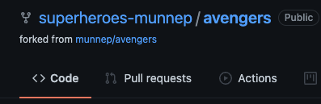

# Git notes

# Summary
This documentation describes the exercise for git training

# Exercise 1: Create a repository

## Goal
- create a new repository

1. login to your github account account  
[https://github.com/](https://github.com/)
1. On the left side repository click on **new**   

3. Fill in the following things
- Reposity name: **avengers**
- Description: **avengers example**
- choose **Public**
- Iinitialize the repository with 
  - **Readme file** 
  - choose a license -> **MIT license**  
  
Click create repository 
4. You should see a repository called avengers  
  

# Exercise 2: Merge a branch

## Goal
- create a branch - feature release
- make a change to the readme file
- create a pull request
- merge into into the main branch 

## steps
1. Go to your repository
  
2. go to the main and switch branch and enter **feature release** and click on the Create branch: feature release
  
3. check that you are on the feature-release branch now
  
4. Change something in the readme file by click on the pencil
  
5. make some changes and go to the bottom 
6. With the commit changes. Write a description of what you changed and commit directly to the feature-release branch button  

7. Click the Commit changes button
8. You now want to merge this change to the main branch
9. Click on the Pull Requests  
  
10. We want to merge the feature-release branch into the main release. Check that it is now like this
  
11. Give it some clear explanation and write something description. Click the **Create Pull request**
  
12. You can now merge the pull request. Click on it
  
13. Confirm the merge request  
  
14. Delete the feature-release branch. Click on it
  
15. Check the results
- You only have the main branch
- You see the change of the README.md you made
   


# Exercise 3: Create a organization

## Goal
- create an organization 

## steps
1. login to your github account account  
[https://github.com/](https://github.com/)
2. On the top right side go to your profile and go to **settings**

3. On the left go to organizations

4. Select New organization  
  
5. select a Free account
  
6. Set up your organization  
- organization account name: **superheroes-munnep**
- Contact email: **patrick.munne@hashicorp.com**
- This organization belongs to: **My personal account**  
  
7. Complete the setup
  
8. Confirm your login credentials
9. Now you should have **Your Organizations** under your username on the top right side
  
10. See an overview of your organization
  
11. You have an organization 
  

# exercise 4

## Goal
- create fork repository from avengers main to orgnization superheroes-munnep
- branch the new fork repostiry to a feature-release using git-cli
- make changes to the README.md
- create a merge to the avengers main repository 
- delete the branch feature-release

## steps
1. login to your github account account  
[https://github.com/](https://github.com/)
2. Go to the repository munnep/avengers main branch
  
3. On the top right side click on **Fork**
  
4. Select **superheroes-munnep**  
  
5. Now we have a new repository called **superheroes-munnep/avengers**
  
6. We need to create a new branch called feature-release
Click on **main** -> Switch branch -> **feature-release** -> click Create branch - feature-release
  
7. From github get the URL to clone the repository. Click on the Code button to see it
  
8. Go to your terminal and a directory where you want to clone the git repository to your local machine
9. Clone it with the following command and switch to to feature release
```
git clone https://github.com/superheroes-munnep/avengers.git
cd avengers
git checkout feature-release
```
10. Make some changes to the README.md
11. Just an example
```
[patrick:~/git/avengers] feature-release ± vi README.md 
[patrick:~/git/avengers] feature-release(+2/-0) 32s ± cat README.md 
# avengers
avengers example

We just made this change in the feature release branch

This has been added by a change which was done on a feature-release branch under a fork in a different organization
```
12. Add the files to git for change and commit them locally
```
git add .
git commit -am "made a change exercise 4"
git push
```
*note: If you get an error with git push about your account saying you need a personal access token then take the steps described by [this link](https://docs.github.com/en/authentication/keeping-your-account-and-data-secure/creating-a-personal-access-token)*
13. Go back to github and the repository superheroes-munnep/avengers. You should see the change you made under branch feature-release
  
14. Merge superheroes-munnep/avengers branch feature-release to the repository avengers branch main 
15. klik on pull requests
  
16. click **new pull request**  
  
17. Check that you merge the branch feature release from superheroes-munnep/avengers to munnep/avengers  
  
18. click the **Create pull request**
  
19. give it a correct name and description and click **create pull request**
  
20. Click the **Merge pull request** 
  
21. Click **Confirm Merge**
  
22. Click **delete branch**  
  
23. You should now see your changes on the main branch of the munnep/avengers repository
  